# Medical Services

<!--
*** Thanks for checking out this README Template. If you have a suggestion that would
*** make this better, please fork the repo and create a pull request or simply open
*** an issue with the tag "enhancement".
*** Thanks again! Now go create something AMAZING! :D
-->

<!-- PROJECT SHIELDS -->
<!--
*** I'm using markdown "reference style" links for readability.
*** Reference links are enclosed in brackets [ ] instead of parentheses ( ).
*** See the bottom of this document for the declaration of the reference variables
*** for contributors-url, forks-url, etc. This is an optional, concise syntax you may use.
*** https://www.markdownguide.org/basic-syntax/#reference-style-links
-->

[![Contributors][contributors-shield]][contributors-url]
[![Forks][forks-shield]][forks-url]
[![Stargazers][stars-shield]][stars-url]
[![Issues][issues-shield]][issues-url]

<!-- PROJECT LOGO -->
<br />
<p align="center">
  <a href="https://github.com/ioanniskousis/medical-services">
    
  </a>
  
  <h3 align="center">The Medical Center Services Application</h3>
  
  <p align="center">
    This project is the Final Assessment on the Microverse curriculum program
    <br />
    <a href="https://github.com/ioanniskousis/medical-services"><strong>Explore the docs</strong></a>
    <br />
    <a href="https://medical-services-jgk.herokuapp.com">Live Demo On Heroku</a>
    <br />
    <a href="https://github.com/ioanniskousis/medical-services/issues">Report Bug</a>
    <span> - </span>
    <a href="https://github.com/ioanniskousis/medical-services/issues">Request Feature</a>
  </p>
</p>

### This is a demonstration of a Medical Center Booking system, providing a booking facility by logged in users

<hr />

<!-- TABLE OF CONTENTS -->

## Table of Contents

- [Screen Shots](#screen-shots)
- [About the Project](#about-the-project)
- [Application Instructions](#application-instructions)
- [Live Version](#live-version)
- [Development](#development)
- [Built With](#built-with)
- [Contributors](#contributors)
- [Acknowledgements](#acknowledgements)

## Screen Shots

### Home
<div style="text-align: center;">
  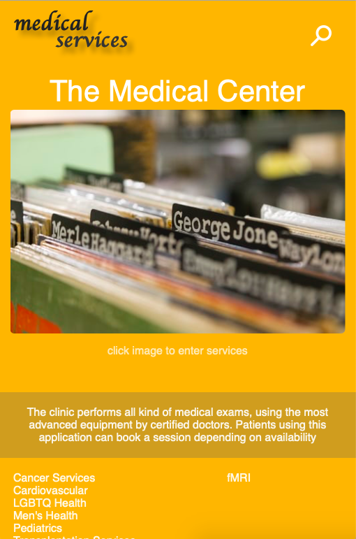
  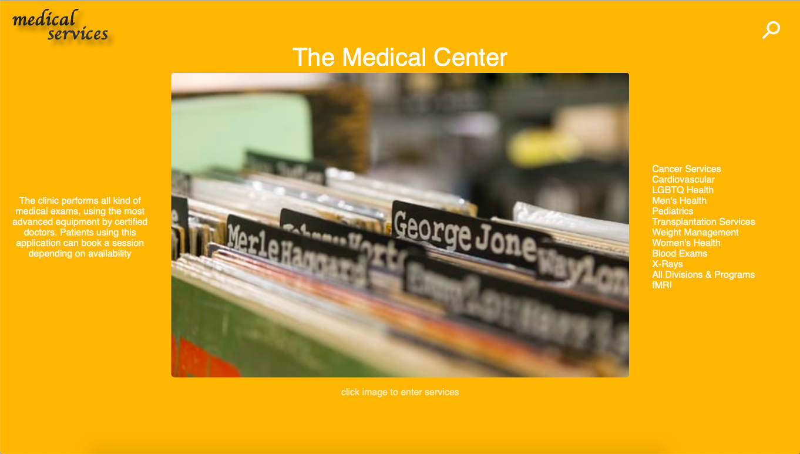
</div>
<hr />

### Services
<div style="text-align: center;">
  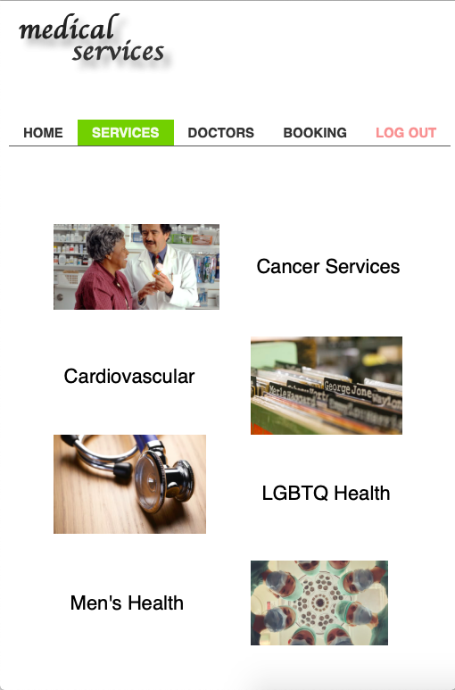
</div>
<hr />

### Doctors
<div style="text-align: center;">
  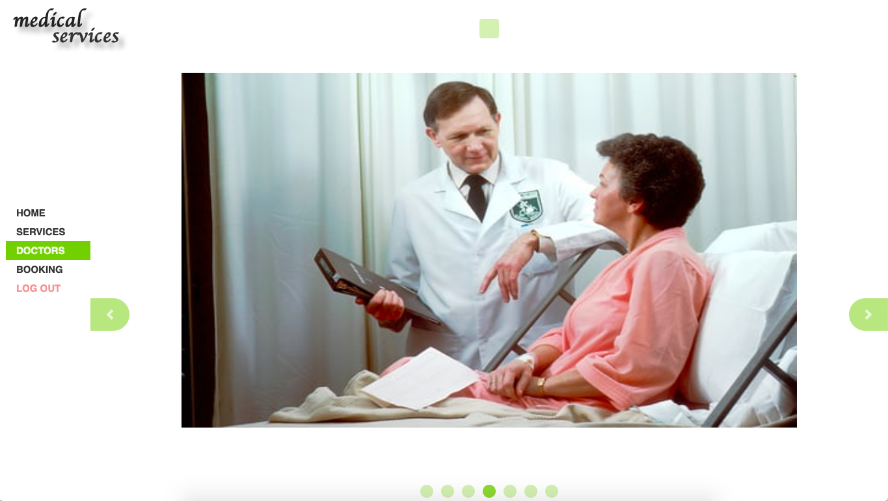
  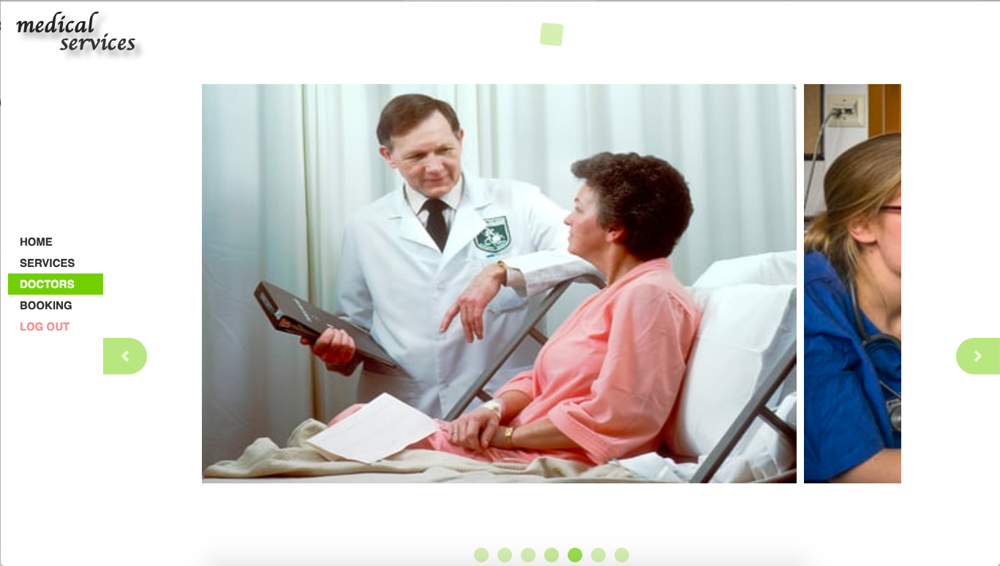
</div>
<hr />

### Booking
<div style="text-align: center;">
  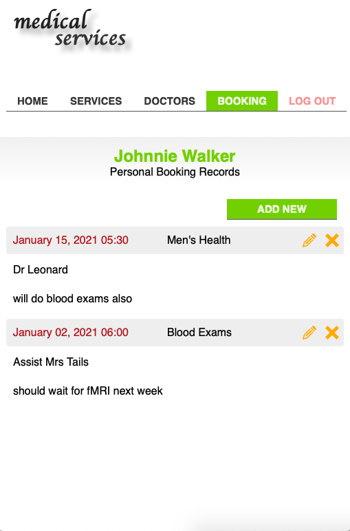
  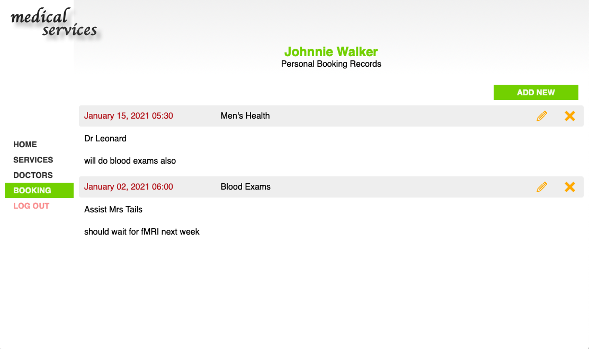
  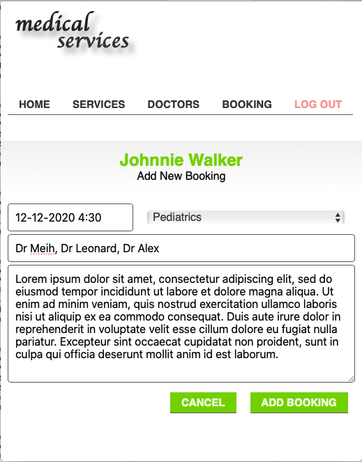
  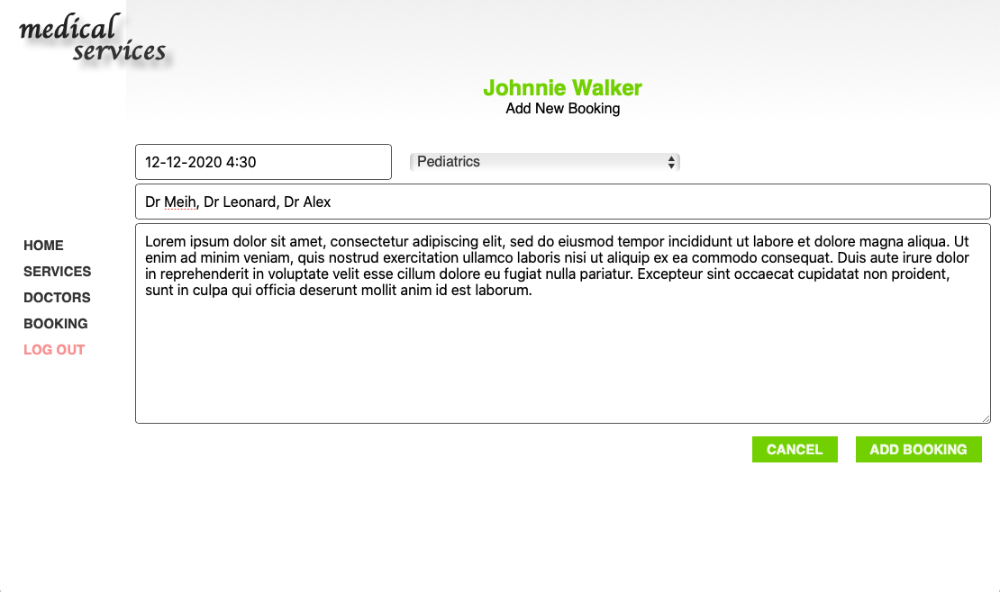
  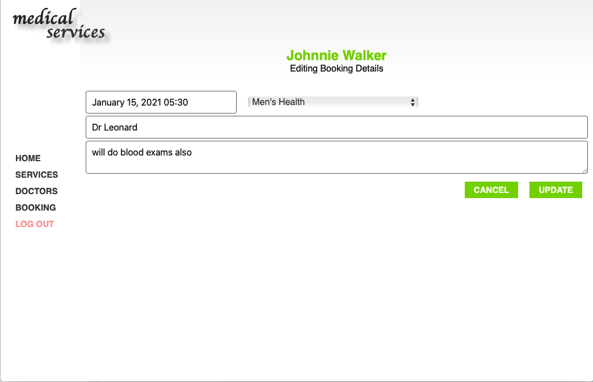
</div>
<hr />

### Sign
<div style="text-align: center;">
  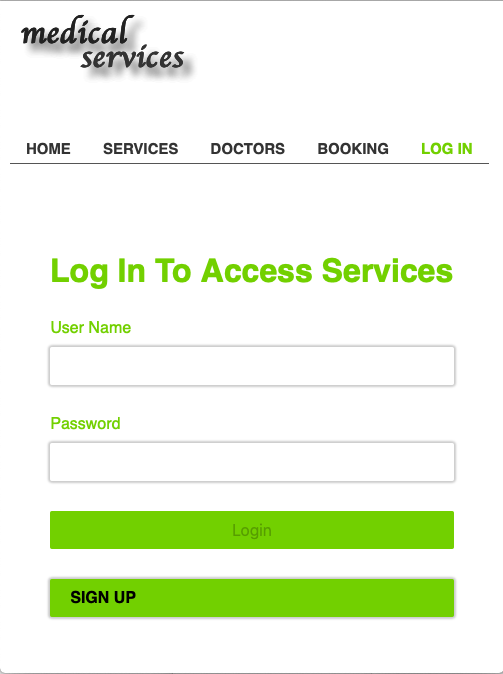
  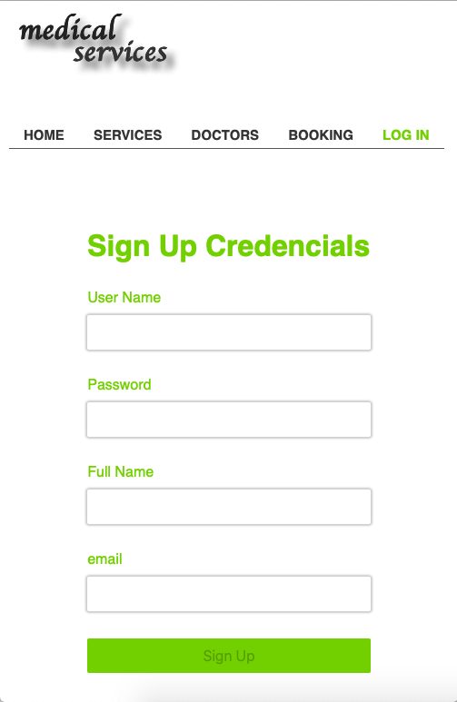
</div>
<hr />

<!-- ABOUT THE PROJECT -->

## About The Project

The project was created as a rails application configured to react using the --webpack=react key  
GitHub was initialized and Linters and rubocop were installed before coding  

The user logs in the application, by typing the username and password, and is presented with a list of services  
An image slider shows the doctors of the medical center  

Booking for a type of service is performed in the Booking view by entering Date, Department, Doctors board and Description  
Booking entries can be edited or deleted  
All bookings of a user are shown in the Bookings List

Design guidelines are based on this [link](https://www.behance.net/gallery/26425031/Vespa-Responsive-Redesign)  
 

- The application responds well to small screens of tablets and mobiles  
- The database has been implemented with Postgres. There is a users table, a table holding the departments and a table holding the bookings  
- For the back-end Ruby on Rails is used. Implements a REST API to manage database resources
- The front-end is using React
    - Connects to the back-end API to send and receive domain data
    - With routes for each of the screens, so the user can easily go back and forward  
    - Using redux to store info used across the app  
- The project has been deployed and accessible online on [heroku]("https://medical-services-jgk.herokuapp.com")

- Transitions have been implement in the Doctors View
        
<hr/>

<!-- ABOUT THE PROJECT -->

## Application Instructions
  In the Home page, click the main image or the search button to access the menu  
  The Services view currently, is static and just shows a grid of items (departments and images)  
  The Doctors View shows a carousel with doctors images left-sliding on demand or automatically  
  The Booking View shows the bookings of the current user and allows add new ones or edit those previously created  

  The SignUp View requires all fields to be filled  

<hr/>

## Live Version

### [On Heroku](https://medical-services-jgk.herokuapp.com)
<hr/>


## Development

- Clone the project

```
  https://github.com/ioanniskousis/medical-services.git  

  run : bandle install  
  run : rails server  
  type in browser 127.0.0.1:3000 to open the application  
```

<hr/>

## Built With

This project was built using these technologies.

- Ruby On Rails
- React
- Redux
- API REST CRUD
- CSS3
- webpack
- Git - GitHub
- ESLint
- Stylelint
- rubocop
- heroku

<hr/>

<!-- CONTACT -->

## Contributors

:bust_in_silhouette:
## Ioannis Kousis

- Github: [@ioanniskousis](https://github.com/ioanniskousis)
- Twitter: [@ioanniskousis](https://twitter.com/ioanniskousis)
- Linkedin: [Ioannis Kousis](https://www.linkedin.com/in/jgkousis)
- E-mail: jgkousis@gmail.com
​
<hr/>
<!-- ACKNOWLEDGEMENTS -->

## Acknowledgements

- [Microverse](https://www.microverse.org/)
- [Thanks to **Behance** for their design inspiration](https://www.behance.net/gallery/26425031/Vespa-Responsive-Redesign) 

<!-- MARKDOWN LINKS & IMAGES -->
<!-- https://www.markdownguide.org/basic-syntax/#reference-style-links -->

[contributors-shield]: https://img.shields.io/github/contributors/ioanniskousis/medical-services.svg?style=flat-square
[contributors-url]: https://github.com/ioanniskousis/medical-services/graphs/contributors
[forks-shield]: https://img.shields.io/github/forks/ioanniskousis/medical-services.svg?style=flat-square
[forks-url]: https://github.com/ioanniskousis/medical-services/network/members
[stars-shield]: https://img.shields.io/github/stars/ioanniskousis/medical-services.svg?style=flat-square
[stars-url]: https://github.com/ioanniskousis/medical-services/stargazers
[issues-shield]: https://img.shields.io/github/issues/ioanniskousis/medical-services.svg?style=flat-square
[issues-url]: https://github.com/ioanniskousis/medical-services/issues
